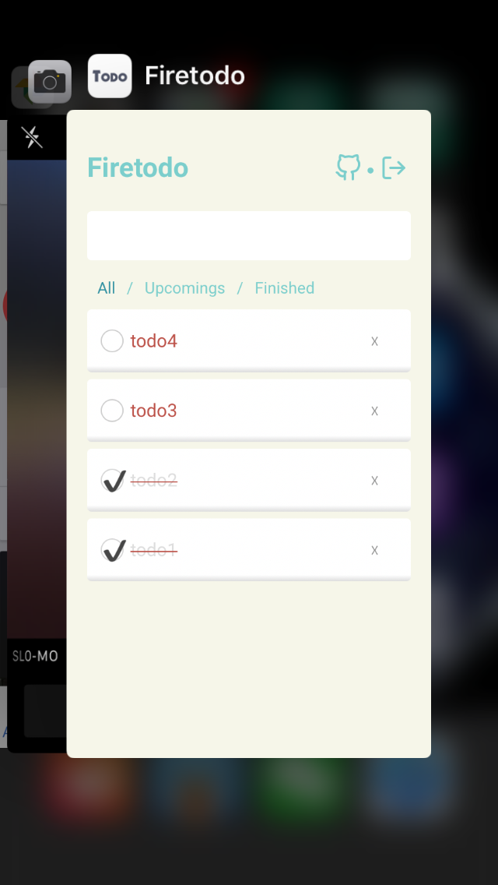

# Firetodo 

Firebase based todo app example. Try the demo [here](https://fire-todoapp.firebaseapp.com/).

## Features

* A real Progressive Web App
* Sign in with Google account
* Realtime sync data between multiple devices
* Serverless (frontend codes only)
* Easy hosting
* Mobile friendly

## Screenshots



## Build your own app

### Prerequisites

* Own a firebase account or google cloud account.
* Create a project and enable firebase auth(Sign in with Google) on firebase console.
* Install firebase-cli by `npm i -g firebase-tools`

### Then

Clone project and install requirements

```
$ git clone git@github.com:cyyyu/firetodo.git
$ npm install
```

Replace `src/config/index.ts` with your firebase configs(Get from your firebase console dashboard)

Login with firebase-cli

```
$ firebase login
```

And use your created project

```
$ firebase use your-project-id
```

Finally, Build and Deploy

```
$ npm run build
$ firebase deploy
```

That's it!

## License

MIT
